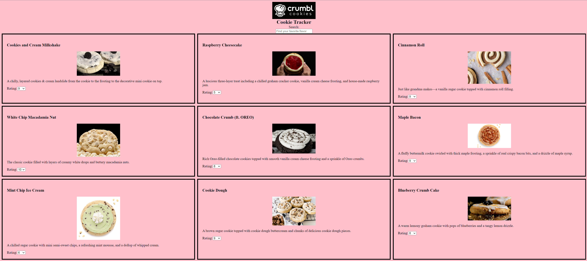

# Crumbl Cookie Tracker

Welcome to your very own private collection of flavors and ratings from crumbl cookies. Anyone who is familiar knows how much crumbl has changed the game for bakeries around the world. However, with a constantly rotating weekly menu, it can be hard to remember which cookies were your favorites. That's exactly the problem that this application is able to solve. Now, you have no need to worry about forgetting a delicious cookie, or buying one that you have had previously that you didn't particularly care for.

## Features

- Select ratings for individual flavors
- Add each week's cookies
- Search for cookies by name
- Responsive design that works on desktop and mobile devices

## Getting Started

These instructions will help you set up the project on your local machine for development and testing purposes.

### Prerequisites

To run this project, you need a web browser and a code editor.

### Installing

1. Clone the repository or download the zip file.
2. Open the project folder in your code editor.
3. Open the `index.html` file in your web browser.

### Usage

1. Type the name of the cookie you're looking for in the search bar.
2. The cookie cards will be filtered in real-time based on your input.

## Acknowledgements

- Thanks to my wife for inspiring this project.
- Thanks to Flatiron school and its instructors for their guidance along the way.